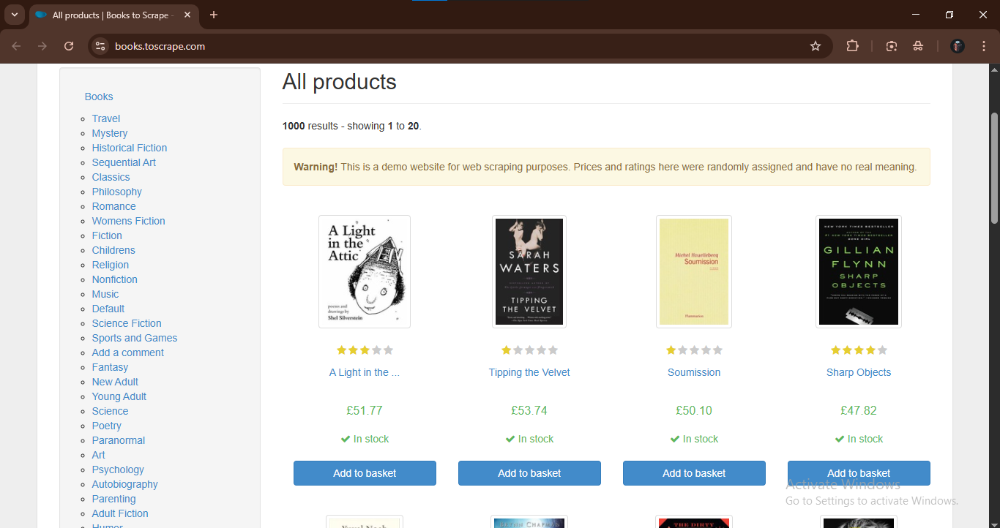
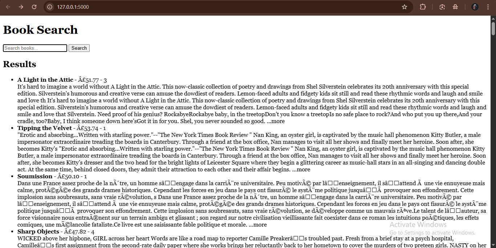
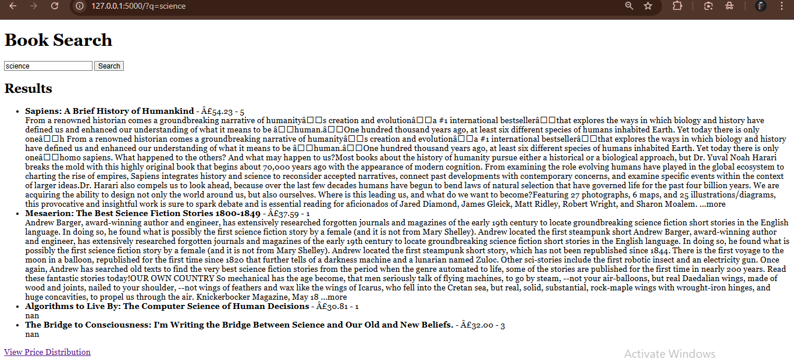
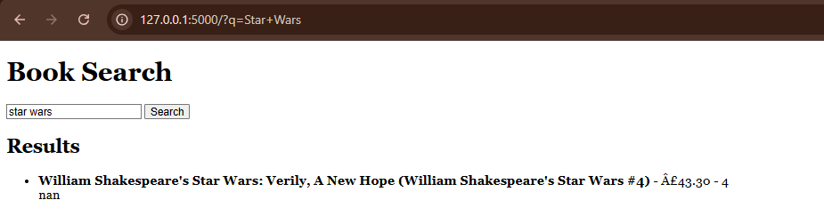

# Book Data Scraper & Explorer

This project was built as part of my **Cantilever Internship**.  
It scrapes book data from *Books to Scrape*, saves it in CSV, and displays it through a Flask web app with search and visualization.

---

## Task Instructions / Objectives
1. Web scraping (e-commerce): collect title, rating, price, description, etc.  
2. Store data in Excel or a database (CSV provided).  
3. Visualize trends (Matplotlib / Seaborn).  
4. Implement search/filter functionality.  
5. Build a simple UI (Flask or Django) to display results.

---

## What I completed
- Scraped fields: `title`, `price`, `rating`, `description`, `category`, `product_page_url`.  
- Output saved as `data/books.csv` (Excel optional).  
- Visualizations: price distribution and rating counts (Matplotlib).  
- Flask UI: table view, search (title partial match) and basic filters (category / price / rating).  
- Polite scraping: User-Agent and rate-limiting implemented.

---

## Quick start

```bash
# Install dependencies
pip install -r requirements.txt

# Run scraper
python Book.py

# Start Flask app
python app.py

```

---

## Screenshots

**Books to Scrape – Original Website**  


**Flask App – Scraped Data Display**  


**Search – Maximum Results Found**  


**Search – Minimum Results Found**  


---
