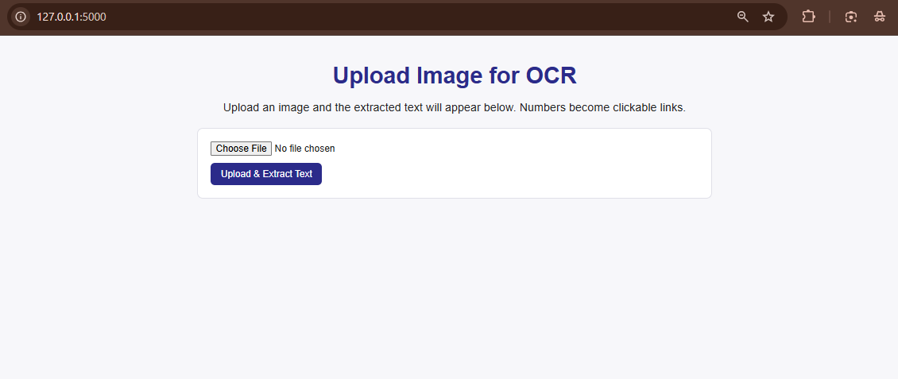
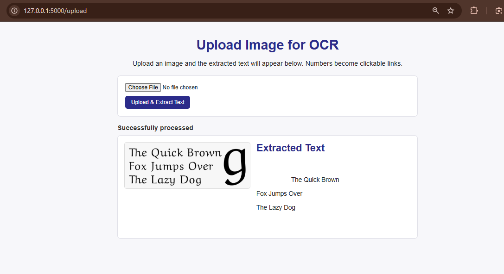
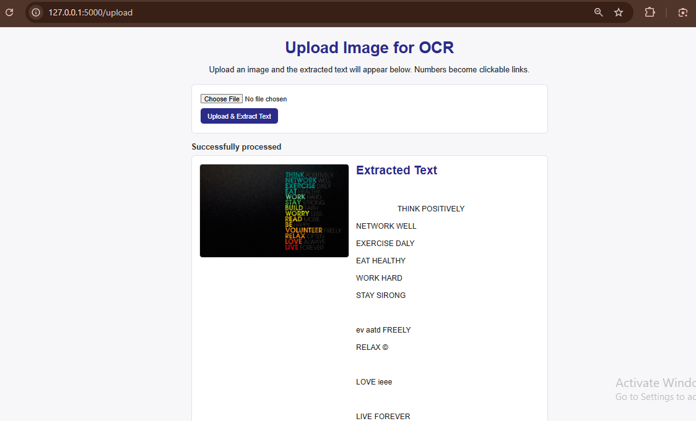

# Text Detection and Extraction 

This project was built as part of my **Cantilever Internship – Task 2**.  
It implements a tiny Flask web app where users can upload an image and extract text using **Tesseract OCR (pytesseract)**. The extracted text is displayed through a simple web interface.


## Theory: 

**OCR (Optical Character Recognition)** is the process of converting printed or handwritten text in images into machine-readable text.  
This project uses the **Tesseract engine** for recognition and **Flask** for a minimal UI.

---

## Features Completed
- Upload image through Flask web UI.  
- Detect and extract text using Tesseract OCR.  
- Display extracted text in the browser.  
- Support for common image formats (JPG, PNG, etc.). 

---

## Quick start

```bash
# Install dependencies
pip install -r requirements.txt

# Run Flask app
python app.py

```

5. Open [http://127.0.0.1:5000/](http://127.0.0.1:5000/) in your browser and upload an image.

---

## Screenshots

### 1. Upload page (empty)


### 2. Image uploaded + OCR result


### 3. Another example/result
